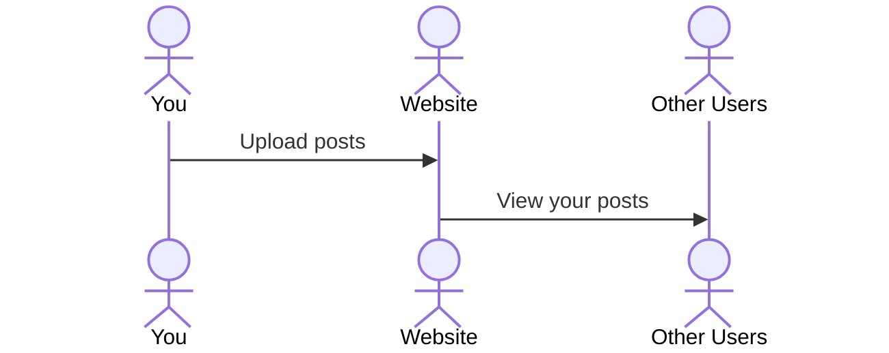

# Game Shelf

[My Notes](notes.md)

[My Website](https://startup.robertthompson.click)

A game reviewing website, focused on giving detailed and honest recommendations of users played Video Games.

## 🚀 Specification Deliverable

For this deliverable I did the following. I checked the box `[x]` and added a description for things I completed.

- [x] Proper use of Markdown
- [x] A concise and compelling elevator pitch
- [x] Description of key features
- [x] Description of how you will use each technology
- [x] One or more rough sketches of your application. Images must be embedded in this file using Markdown image references.

### Elevator pitch

Video games are massive investments, both in money and in time. On top of that, everyone has very specific tastes and preferences, and every game is appealing to a different group of people. Because of this, basic review sites don't quite cover the level of complexity that is required for video game criticosm. I want to develop a site that allows users to upload detailed reviews and generate a discussion about the games they play. Think letterboxd for games.

### Design

A rough sketch of how creating a post might look. Basic elements include a field to write the review, a dropdown menu to choose a rating between 1-10, a field to add tags, a field to add how many hours were spent playing the game (and possibly also completion level), and a field to add tags (such as "casual", "high-intensity" or "strategy")

### Key features

- Creating an account
- Posting a review
- Viewing other profiles

### Technologies

I am going to use the required technologies in the following ways.

- **HTML** - Organizing where on the screen posts, profiles, and search features, etc. are
- **CSS** - Styling the page, making it look good
- **React** - Show posts (game icons, profile pictures)
- **Service** - Profile creation
- **DB/Login** - Storing profiles/login services
- **WebSocket** - Viewing other profiles

## 🚀 AWS deliverable

For this deliverable I did the following. I checked the box `[x]` and added a description for things I completed.

- [x] **Server deployed and accessible with custom domain name** - [My server link](https://robertthompson.click).

## 🚀 HTML deliverable

For this deliverable I did the following. I checked the box `[x]` and added a description for things I completed.

- [x] **HTML pages** - I created pages for the home, making a post, login, viewing the user's profile, and viewing other posts.
- [x] **Proper HTML element usage** - Created sections, elements and inputs for each page.
- [x] **Links** - Each page links to one another via a navigation bar.
- [x] **Text** - Each page contains text labels, instruction and/or examples of posts.
- [x] **3rd party API placeholder** - Added placeholder on post.html and profile.html.
- [x] **Images** - Added a default profile picture.
- [x] **Login placeholder** - Added a login and create account page.
- [x] **DB data placeholder** - Added placeholder to login.html.
- [x] **WebSocket placeholder** - Added data placeholder on profile.html and view.html.

## 🚀 CSS deliverable

For this deliverable I did the following. I checked the box `[x]` and added a description for things I completed.

- [x] **Header, footer, and main content body**
- [x] **Navigation elements** - Links stylized in the header
- [x] **Responsive to window resizing** - cards containing individual reviews are formatted based on window size, when wide enough, they are viewed two across. The title and footer disappear when the window is too short.
- [x] **Application elements** - Cards, text boxes and other elements were arranged
- [x] **Application text content** - Text was formatted to be more readable and clear
- [x] **Application images** - profile images were made circular

## 🚀 React part 1: Routing deliverable

For this deliverable I did the following. I checked the box `[x]` and added a description for things I completed.

- [x] **Bundled using Vite**
- [x] **Components** - Each page has proper HTML and CSS bundled into the react
- [x] **Router** - The router functions properly

## 🚀 React part 2: Reactivity deliverable

For this deliverable I did the following. I checked the box `[x]` and added a description for things I completed.

- [x] **All functionality implemented or mocked out** - Only parts missing are database and API
- [x] **Hooks** - Added hooks that retrieve data from backend

## 🚀 Service deliverable

For this deliverable I did the following. I checked the box `[x]` and added a description for things I completed.

- [x] **Node.js/Express HTTP service** - backend that is called via api
- [x] **Static middleware for frontend** - public folder for default pfp and app logo
- [x] **Calls to third party endpoints** - Calls playerdb to retrieve avatar based on steam ID
- [x] **Backend service endpoints** - endpoints for adding users, signing in, adding posts, and viewing posts
- [x] **Frontend calls service endpoints** - all endpoints are called
- [x] **Supports registration, login, logout, and restricted endpoint** - only verified users are able to make posts and view profile

## 🚀 DB deliverable

For this deliverable I did the following. I checked the box `[x]` and added a description for things I completed.

- [x] **Stores data in MongoDB** - users and posts are stored
- [x] **Stores credentials in MongoDB** - updates user doc with tokens

## 🚀 WebSocket deliverable

For this deliverable I did the following. I checked the box `[x]` and added a description for things I completed.

- [ ] **Backend listens for WebSocket connection** - I did not complete this part of the deliverable.
- [ ] **Frontend makes WebSocket connection** - I did not complete this part of the deliverable.
- [ ] **Data sent over WebSocket connection** - I did not complete this part of the deliverable.
- [ ] **WebSocket data displayed** - I did not complete this part of the deliverable.
- [ ] **Application is fully functional** - I did not complete this part of the deliverable.
